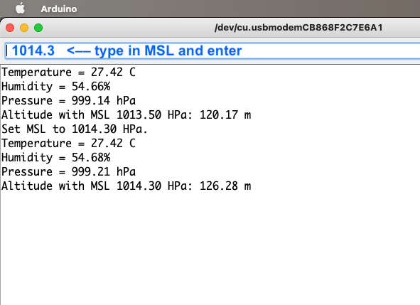

# RUI3_BMx80_Test

A test showing how to detect a bme680 from a bme280 with the same I2C address.

Uses the [RAK1906 library](https://downloads.rakwireless.com/RUI/RUI3/Library/) and Seeedstudio's [Seeed_BME280 library](https://github.com/Seeed-Studio/Grove_BME280). There are modifications to do in both libraries, check the .ino file.

Altitude is calculated with a default MSL of 1013.5. That's probably not the case where you are (although today it was pretty close for me!) Check with your weather service, and type in the MSL. The altitude will be adjusted.

## BONUS TRACK

You get to enjoy my `i2cScan` code in action!